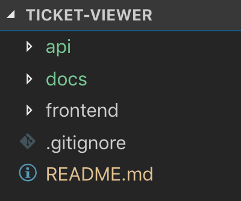

# Ticket Viewer
### Customer service tool that allows the creation and management of support tickets.

[Github Repository](https://github.com/SeepG/ticket-viewer)

### Author: Seep Gulati
[Linkedin](https://www.linkedin.com/in/seepgulati) | [Twitter](https://twitter.com/seepgulati)

### Functionality
- Ticket Viewer allows user to browse through tickets.
- Ticket Viewer allows user to check individual tickets 

### User stories

User stories have been planned as per role, action and business goal/reasoning).

As a User(role),
I want to connect to the Zendesk API (action).
So that I can view the tickets for my account (business-goal/reasoning).

As a User,
I want the option to page through tickets when more than 25 are returned.
So that I am able to see them easily and work through them.

As a User, 
I want to browse all the tickets (action),
So that I can know how many tickets are requiring my attention.

As a User,
I want to see individual ticket.
So that I can start work on closing the ticket.

### Demo gif

### Technology Stack
Ticket-Viewer is built using a simple REST API with NodeJS and Express. PostMan has been used for testing. HTML, Javascript and Bootstrap for the front-end. 

### Architecture of application
Back End - Nodejs & Expressjs | Front End - Javascript, HTML and Bootstrap

### Softwares used in application
* Javascript - ES7 
* Node - 10.16.0
* Express - 4.16.1
* NPM as a packet manager gave us access to various libraries and programs and easily manage the installation process.
* Visual Studio Code helped in writing source-code and supported debugging.

### Prerequisites
The first thing you need to have is Node.js on your computer.You can download the Node.js installer from the Node.js website at: https://nodejs.org/en/download/

Once Node.js is installed, open a terminal and enter the `node --version` on command line to verify that it is installed correctly. This application is using Node 10.16.0 version.

## Installation

1. Navigate to a location where you want to install the source and run `git clone https://github.com/SeepG/ticket-viewer.git`

2. You need to open the git repository in a code editor of your choice. I'm using visual studio code. Download link: https://code.visualstudio.com/docs/setup/mac

3. cd into api folder and run below command.
`npm install`

4. To start the api, run below command.
 `npm start` 
 
5. You will see the App listening on port 8000

6. To view UI in the browser. Download Live server Visual Studio code.extension. Download link: https://marketplace.visualstudio.com/items?itemName=ritwickdey.LiveServer

7. Once live server is installed. Click on index.html file link and right click to open with live server. Refer screenshot below.

 

## Folder structure

Complete folder structure is as follows:
Ticket-Viewer 
- api (main folder for back-end application)
  - src
    - entities
        - TicketDetailsResponse
        - TicketsResponse  
    - tests
        - getAllTickets.test.js
        - getIndividualTicket.test.js
    - config.js
    - getAllTickets.js 
    - getIndividualTicket.js
    - index.js
  - .babelrc
  - .env
  - package-lock.json
  - package.json
- docs
- front end (main folder for front-end application)
    - index.html
    - script.js
    - style.css
- .gitignore
- README.md

Rationale/Approach

- dist and node-modules - Have been added to .git ignore because of heavy file size as well as they would be generated again when npm install is run.

- entities under Src - Created classes to get customized response from API. It not helped in separation of concern but also helped in designing the UI.

- tests - Two happy paths test have been laid out in test folder. Mock data has been used for testing purpose. It helps in simulate errors and circumstances that would otherwise be very difficult to create in a real world environment. 

- config.js - Static class variables have been utilized so that we can get those values when the application starts and there is no need to instantiate the config class.

backend code has been separated into three files:
  1. getAllTickets.js receives all tickets from api. 
  2. getIndividualTicket.js retrieves individual ticket from api.
  3. index.js runs the server and error handling statements. It is main file.

- .env - Dotenv module used to protect api sensitive information. 
Configuration information was saved in a .env file and Dotenv loaded the environment variables into process.env. .env file has been added to git ignore for extra layer of security.

- package.json - Carries the details of all application dependencies.

- docs - Carries images embedded in README.md.

- Frontend code has been divided into three files- 
  1. index.html to run UI via live server.
  2. script.js has browser javascript.
  3. style.css has additional styling.

- .gitignore - ignores the file which shouldn't be on git.

## Design process
This application has been designed for "Desktop-first" experience, as customer service team will resolve queries over desktop in a real life scenario.

### Error handling
- Displays a error message if the API is unavailable.
- Tells the user something is wrong if there is a program error.

### Testing process
- Tried Mocha and Chai earlier. Didn't get them to work so moved instead to Jest unit testing. Also, Axios mock adapter was used for testing.
- Upgraded Babel 6 to 7. Added Jest dependencies. 
- Set up test requirements.Wrote Happy Path test cases for user stories.

# To run tests
`npm test` 

Happy Path tests
Test case 1: Show all tickets from the User account.
Displaying all tickets with 200 status code.

Test case 2: Show individual ticket.
Displaying individual ticket with 200 status code.

### Version control process 
Git commits after every feature and test run.

### Workflow timeline 

#### Day1
- Planning
- Research
- Notebook tracker & Trello to track project timeline.

#### Day2
- Populated tickets through Postman and got sample 101 tickets to play around.  
- Researched on express server.
- Add dependencies and configuration.

#### Day3
- Explored express server boilerplate.
- Tried UI code.
- Worked on receiving responses from API.
- Created Git repository.

#### Day 4
- Worked on back-end application
- Getting tickets from API.
- Separated concerns and put user stories under different classes.

#### Day5
- Researched on testing frameworks.
- Worked on trial UI.
- Installed Mocha, Chai and Nock.
- Set unit test requirements.
- Testing with Jest.

#### Day6
- Worked on Front end application. 
- Making app MVP ready.
- Updated ReadMe documentation.

#### Day7 
- Ensured that code is well commented.
- Updated ReadMe documentation.
- Submission

#### Trello captures MVP and stretch goals
[Link to Trello board](https://trello.com/b/yGOryhco/ticket-viewer)

#### Learning approach
I learn best with a combination approach - reading blogs,tutorials, code-along on youTube, class, practically exploring and even attending community meet-ups to get a top-level perspective on new concepts. We were introduced to Javascript two weeks ago. Express js and testing were totally new topics for me, I have gone through original documentation and other tutorials to work through this challenge. 
Out of countless online resources which were referred, few of the links below carry special mention for getting this done.

Express
https://github.com/developit/express-es6-rest-api

Jest (all 3 videos under Jest testing)
https://www.youtube.com/watch?v=4kNfeI37xu4&list=PLLnpHn493BHEB-YOl0APuQsrzlb3zbq3y
https://medium.com/@ryanblahnik/setting-up-testing-with-jest-and-node-js-b793f1b5621e

Babel trouble
https://github.com/facebook/jest/issues/6913
